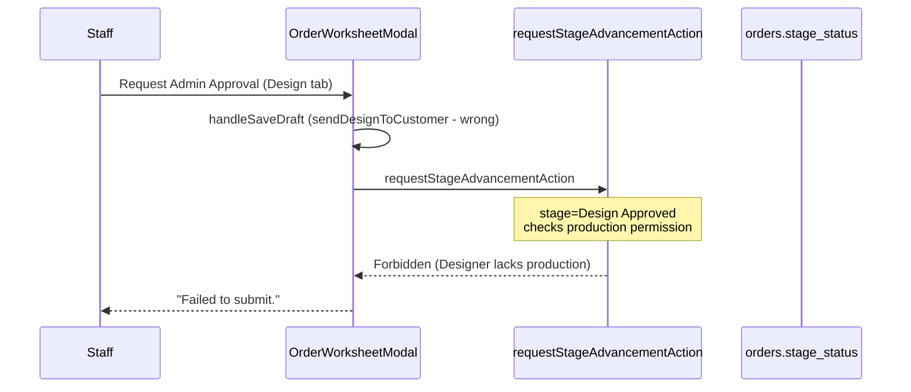

# Fix Design Admin Approval + Dual Portal Lock

## Root cause

The button lives in `[OrderWorksheetModal.tsx](src/features/order-detail/components/OrderWorksheetModal.tsx)` (`handleRequestAdvancement` → `requestStageAdvancementAction`). The generic error `"Failed to submit."` hides the real server error.

### Upload vs submit — two different permission checks


| Action                                      | Code path                                                               | Permission checked                            | Designer can do it?          |
| ------------------------------------------- | ----------------------------------------------------------------------- | --------------------------------------------- | ---------------------------- |
| Upload production files on Design tab       | `DesignModule.handleProductionFileUpload` → `updateDesignDetailsAction` | `**design**` (`assertStageEditOrPortalOrder`) | **Yes** — already works      |
| Request Admin Approval at `Design Approved` | `requestStageAdvancementAction`                                         | `**production**` (buggy mapping)              | **No** — this is the failure |


Production files are stored inside `designs.items[].productionFiles` (design JSONB), not the Production stage module. Designers uploading `.cdr`/`.dxf` files on the Design tab is intentional and does **not** require the `production` stage grant.

**Primary bug:** Only the **submit-for-approval** action mis-maps `Design Approved` → `production` permission:

```404:404:src/features/orders/actions/orderActions.ts
    "Design Approved": isDesignFirst ? "design" : "production",
```

For `quote_first` orders, once the customer approves all proofs the order moves to `**Design Approved**`. Staff upload production files (works), then click **Request Admin Approval for Design Workflow** (fails). Designers have `["site_visit", "design"]` per `[stageGrants.ts](src/features/orders/workspace/shared/stageGrants.ts)` — they should **not** need the Production tab grant just to hand off completed design work.

### Recommended fix (do NOT add `production` to Designer grants)

**Option A (recommended):** In `requestStageAdvancementAction`, map `"Design Approved"` → `"design"` permission always.

- Designers keep uploading production files on the Design tab (unchanged).
- Designers can submit for admin approval after upload (fixed).
- Designers still **cannot** open/edit the separate Production worksheet tab (correct separation of duties).

**Decision for implementation:** Use **Option A** — one-line permission fix plus the rest of the plan (locks, admin reject). No change to `stageGrants.ts`.

**Secondary issues:**

- `handleRequestAdvancement` always calls `handleSaveDraft()` first; on the Design tab that runs `sendDesignToCustomerAction` (wrong side effect for an approval request).
- Design tab has **no freeze logic** (`isCurrentTabFrozen` only covers Site Visit tab index `0`).
- Customer `[DesignTab.tsx](src/app/portal/components/DesignTab.tsx)` ignores `stageStatus` entirely — no lock.
- Spec documents `adminRejectStageAction` (`[admin-dashboard.md](specs/admin-dashboard.md)`) but it **does not exist** — no way for admin to "Request Changes" and unlock.




## Fix plan

### 1. Fix permission + advancement action

**File:** `[src/features/orders/actions/orderActions.ts](src/features/orders/actions/orderActions.ts)`

- Change `"Design Approved"` mapping to always use `"design"` permission (staff are completing the design handoff, not starting production work).
- Add `**adminRejectStageAction(orderId, notes)**` (spec'd but missing):
  - `assertAdminOnly()`
  - Require non-empty `notes`
  - Set `stage_status: "Normal"` and `stage_admin_notes: notes`
  - Insert `order_activity` timeline row
  - Revalidate staff + portal paths
- Optionally add `**assertDesignStageUnlocked(orderId)**` helper here (or in `serverPermissions.ts`) used by design mutations: block portal + staff edits when `stage_status` starts with `"Pending Admin Approval"` and order stage is `Design In Progress` or `Design Approved`. **Admins bypass.**

### 2. Fix worksheet submit handler

**File:** `[src/features/order-detail/components/OrderWorksheetModal.tsx](src/features/order-detail/components/OrderWorksheetModal.tsx)`

- In `handleRequestAdvancement`:
  - **Skip `handleSaveDraft()`** when `activeStepTab === designTab` (design edits are already persisted via `updateDesignDetails`; approval is not "send to customer").
  - On success, **optimistically update local state**: `setOrder(prev => ({ ...prev, stageStatus: <computed pending value> }))` so the UI locks immediately without waiting for refresh.
  - Surface real errors: `triggerLocalAlert(err?.message || "Failed to submit.", "error")`.
- Extend `**isCurrentTabFrozen**` to cover the design tab (mirror Site Visit pattern):

```ts
// Design frozen when pending admin approval on a design-stage order
const isDesignPending =
  order.stageStatus !== "Normal" &&
  (order.stage === "Design In Progress" || order.stage === "Design Approved");

const isCurrentTabFrozen =
  (activeStepTab === 0 && siteVisitFrozenCondition) ||
  (activeStepTab === designTab && isDesignPending && !adminOverrideUnlocked);
```

- Pass `adminOverrideUnlocked` / `setAdminOverrideUnlocked` and a `readOnly`/`isFrozen` prop into `[DesignModule.tsx](src/features/orders/workspace/modules/design/DesignModule.tsx)`.
- Hide footer **Save Draft / Request Admin Approval** buttons when design tab is frozen (already gated by `!isCurrentTabFrozen`).
- Show `stageAdminNotes` banner on design tab when admin has requested changes.

### 3. Lock staff DesignModule UI

**File:** `[src/features/orders/workspace/modules/design/DesignModule.tsx](src/features/orders/workspace/modules/design/DesignModule.tsx)`

- Add props: `isFrozen?: boolean`, `adminOverrideUnlocked?`, `setAdminOverrideUnlocked?`, `stageAdminNotes?`, `currentUserRole?`.
- When frozen: disable uploads, deletes, production-file edits; show amber "Pending admin review" banner.
- Reuse Site Visit **Admin God Mode** unlock toggle pattern from `[SiteVisitModule.tsx](src/features/orders/workspace/modules/site-visit/SiteVisitModule.tsx)` (admin-only).

### 4. Lock customer portal Design tab

**Files:**

- `[src/app/portal/components/DesignTab.tsx](src/app/portal/components/DesignTab.tsx)`
- `[src/app/portal/order/[orderId]/OrderDetailClient.tsx](src/app/portal/order/[orderId]/OrderDetailClient.tsx)`
- `[src/app/portal/PortalClient.tsx](src/app/portal/PortalClient.tsx)`
- Pass `stageStatus` and `stageAdminNotes` on the `order` prop (already available on parent order objects).
- In `DesignTab`, compute:

```ts
const isLocked =
  order.stageStatus !== "Normal" &&
  (order.stage === "Design In Progress" || order.stage === "Design Approved");
```

- When locked: read-only viewer (no resource upload, pin comments, general feedback, or approve buttons). Show banner: *"Your design is under internal review. We'll notify you when it's ready for the next step."*
- When `stageAdminNotes` present (after admin requested changes): show admin feedback message to customer.
- Ensure realtime sync (`useOrderDetailSync`) propagates `stageStatus` changes so lock/unlock is live.

### 5. Admin "Request Changes" button

**File:** `[src/features/order-detail/components/admin/AdminControlModule.tsx](src/features/order-detail/components/admin/AdminControlModule.tsx)`

- Add **Request Changes** button next to **Approve Stage** when `stageStatus !== "Normal"`.
- Opens a small modal requiring notes → calls `adminRejectStageAction`.
- On success, `stage_status` returns to `"Normal"` → unlocks staff design worksheet + customer portal for revisions.

### 6. Server-side enforcement (defense in depth)

**File:** `[src/features/designs/actions/designActions.ts](src/features/designs/actions/designActions.ts)`

- Call the new unlock assertion at the start of `updateDesignDetailsAction`, `sendDesignToCustomerAction`, and other staff/customer design write paths.
- Prevents bypassing UI locks via direct action calls.

## Verification checklist


| Scenario                                                                   | Expected                                                                                      |
| -------------------------------------------------------------------------- | --------------------------------------------------------------------------------------------- |
| Designer on `quote_first` order at `Design Approved` with production files | Request Admin Approval succeeds → `stage_status` = `Pending Admin Approval: Production Ready` |
| After request                                                              | Staff design tab + customer Design tab are read-only                                          |
| Admin clicks Request Changes with notes                                    | `stage_status` = `Normal`, notes visible, both portals editable again                         |
| Admin clicks Approve Stage                                                 | Stage advances (e.g. to `Production`), lock clears via stage change                           |
| Designer at `Design In Progress` (pre-approval)                            | Request sets `Pending Admin Approval: Design Approval`, same lock behavior                    |
| Error cases                                                                | UI shows actual server message (e.g. forbidden, validation)                                   |


## Files touched (summary)


| File                                         | Change                                                                   |
| -------------------------------------------- | ------------------------------------------------------------------------ |
| `orderActions.ts`                            | Fix permission map; add `adminRejectStageAction`; optional unlock helper |
| `OrderWorksheetModal.tsx`                    | Fix handler, design freeze, pass props, error surfacing                  |
| `DesignModule.tsx`                           | Frozen/read-only UI + admin override                                     |
| `DesignTab.tsx`                              | Customer portal lock + banners                                           |
| `AdminControlModule.tsx`                     | Request Changes UI                                                       |
| `designActions.ts`                           | Server-side lock enforcement                                             |
| `OrderDetailClient.tsx` / `PortalClient.tsx` | Ensure `stageStatus`/`stageAdminNotes` passed through                    |


No DB migration required — uses existing `orders.stage_status` and `orders.stage_admin_notes` columns.