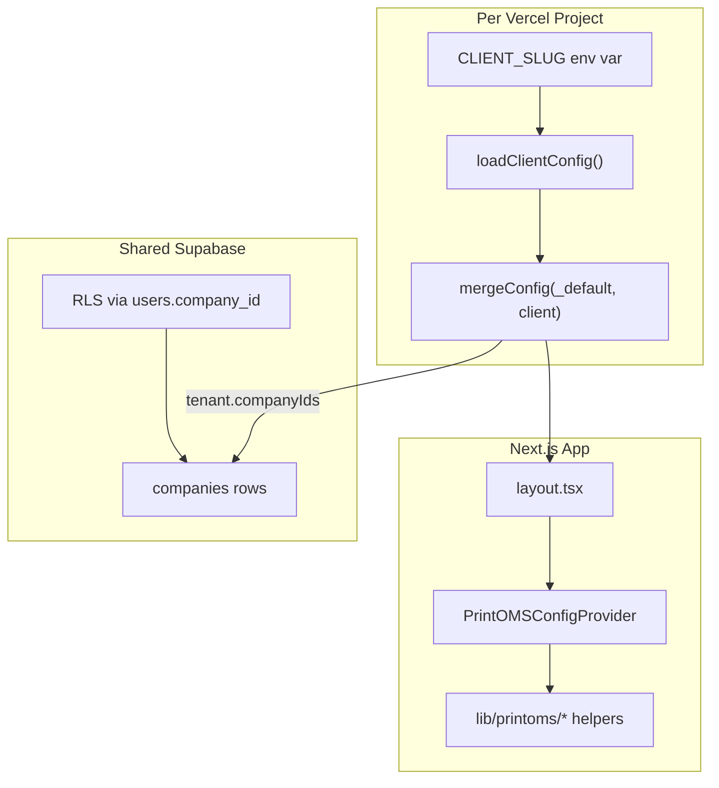

# PrintOMS Multi-Client Config — Phased Implementation Plan

## Current state (baseline)

The repo is **multi-tenant in Supabase** (`company_id` + RLS) but **single-tenant in the app**:


| Area             | Today                                                                                                          | Target                                                      |
| ---------------- | -------------------------------------------------------------------------------------------------------------- | ----------------------------------------------------------- |
| Tenant identity  | `company_id` UUID in DB + RLS                                                                                  | Same — RLS remains the security boundary                    |
| App config       | Hardcoded in `[stageGrants.ts](src/features/orders/workspace/shared/stageGrants.ts)`, env vars, inline strings | `config/clients/{slug}/*` merged from `_default`            |
| Branding         | Global `[globals.css](src/app/globals.css)` + "NORTHSTAR"/"PRINTOMS" strings                                   | Per-client `theme.ts` + `labels.ts` via CSS vars + provider |
| WhatsApp         | Hardcoded `printec_*` in `[templates.ts](src/features/notifications/whatsapp/templates.ts)`                    | Prefix from `integrations.ts` per Vercel project            |
| Deploy model     | Single app, single env                                                                                         | One Vercel project per client, same `main` branch           |
| Seeded companies | Printoms (`11111…`) + Board Company (`22222…`)                                                                 | 5 companies; **Printec gets a new UUID** (your choice)      |





---

## Phase 0 — DB foundation and slug registry (1–2 days)

**Goal:** Stable company rows and a single source of truth for slug ↔ UUID mapping before config files reference UUIDs.

### Work

1. **Migration: extend `companies` table**
  - Add `slug text unique` column (indexed).
  - Add optional branding columns from `[specs/system-settings.md](specs/system-settings.md)` only if needed in Phase 2 (`logo_url` can wait).
2. **Migration: seed all five tenants**

  | Slug                | Display name      | UUID strategy                                        |
  | ------------------- | ----------------- | ---------------------------------------------------- |
  | `the-board-company` | The Board Company | Keep existing `22222222-2222-2222-2222-222222222222` |
  | `printec`           | Printec           | **New UUID** (your decision)                         |
  | `signworld`         | Signworld         | New UUID                                             |
  | `hitech-vision`     | Hitech Vision     | New UUID                                             |
  | `indian-design`     | Indian De'sign    | New UUID                                             |

3. **Data migration for Printec new UUID**
  - If existing production data lives under old Printoms UUID (`11111…`), write a one-time migration to re-point `users`, `orders`, `customers`, etc. to the new Printec UUID — or explicitly retire the old row if it was dev-only.
  - Update `[stageGrants.ts](src/features/orders/workspace/shared/stageGrants.ts)` constants to reference config instead (Phase 3).
4. **Docs:** Create `[docs/printoms/clients.md](docs/printoms/clients.md)` with slug, UUID, Vercel project name, domain.

### Verify

- `SELECT id, slug, name FROM companies` returns 5 rows with unique slugs.
- Board Company users still resolve to `22222…` via RLS.
- No app code changes required yet.

---

## Phase 1 — Config infrastructure (2–3 days)

**Goal:** Build the config layer with zero runtime behavior change. App still works exactly as today.  
Have seperate specs folder for each client and have seperate phase wise md files for each tenent.

### New files (repo root)

```
config/
├── schema/
│   ├── index.ts
│   ├── clientConfig.ts      # PrintOMSClientConfig root type
│   ├── theme.ts
│   ├── workflow.ts
│   ├── labels.ts
│   ├── features.ts
│   ├── integrations.ts
│   └── tenant.ts
├── clients/
│   ├── _default/            # PrintOMS base — all keys populated
│   └── the-board-company/   # Pilot client (your rollout choice)
├── env/
│   ├── README.md
│   ├── .env.shared.example
│   └── the-board-company.env.example
├── registry.ts              # slug → import map (all 5 slugs registered)
├── mergeConfig.ts           # deep-merge _default + overrides
└── loadClientConfig.ts      # reads CLIENT_SLUG, throws if unknown
```

### Key implementation details

- `**mergeConfig.ts`:** Deep-merge objects; arrays in overrides replace (not concat) unless you explicitly need merge semantics for `companyIds`.
- `**loadClientConfig.ts`:** Read `process.env.CLIENT_SLUG` (server) / `process.env.NEXT_PUBLIC_CLIENT_SLUG` (client-safe subset). Fail fast at build/start if missing or unknown slug.
- `**registry.ts`:** Static map — avoids dynamic `import()` issues on Vercel:

```ts
// config/registry.ts (conceptual)
export const CLIENT_REGISTRY = {
  "the-board-company": () => import("./clients/the-board-company"),
  printec: () => import("./clients/printec"),
  // ...
} as const;
```

- **TypeScript:** Add path alias in `[tsconfig.json](tsconfig.json)`:

```json
"@config/*": ["./config/*"]
```

- **Pilot config content (`the-board-company`):** Port existing behavior from `[stageGrants.ts](src/features/orders/workspace/shared/stageGrants.ts)` `BOARD_COMPANY_ID` block into `workflow.ts` and `tenant.ts`.
- **Stub folders:** Create skeleton `index.ts` + empty overrides for `printec`, `signworld`, `hitech-vision`, `indian-design` (inherit `_default` only).

### Verify

- Unit test: `mergeConfig(_default, boardOverrides)` returns expected shape.
- Unit test: `loadClientConfig()` with `CLIENT_SLUG=the-board-company` resolves Board Company `companyIds`.
- `npm run build` passes with `CLIENT_SLUG=the-board-company` set (even before app wiring).

---

## Phase 2 — App wiring: theme, provider, metadata (2–3 days)

**Goal:** Root layout loads config and exposes branding to the UI. Still no workflow/WhatsApp migration.

### New files


| File                                                                                   | Role                                                                    |
| -------------------------------------------------------------------------------------- | ----------------------------------------------------------------------- |
| `[src/providers/PrintOMSConfigProvider.tsx](src/providers/PrintOMSConfigProvider.tsx)` | React context: `labels`, `theme`, `features` (serializable subset only) |
| `[src/lib/printoms/getClientConfig.ts](src/lib/printoms/getClientConfig.ts)`           | Re-export from `@config/loadClientConfig`                               |
| `[src/lib/printoms/applyTheme.ts](src/lib/printoms/applyTheme.ts)`                     | Map `theme.ts` → CSS custom properties on `<html>`                      |
| `[src/lib/printoms/resolveBranding.ts](src/lib/printoms/resolveBranding.ts)`           | Merge file config + optional `companies.name` / `logo_url` from DB      |


### Changes

1. `**[src/app/layout.tsx](src/app/layout.tsx)**` (server component):
  - Call `getClientConfig()` at module scope or in layout.
  - `generateMetadata()` driven by `config.labels.appName`.
  - Inject `applyTheme(config.theme)` as inline style or CSS vars on `<html>`.
  - Wrap children in `<PrintOMSConfigProvider config={clientSafeConfig}>`.
2. **Replace hardcoded brand strings** in shell components (surgical, highest-visibility first):
  - `[AdminLayoutClient.tsx](src/app/admin/(dashboard)`/AdminLayoutClient.tsx) — "NORTHSTAR" → `labels.appName`
  - `[StaffLayoutClient.tsx](src/app/staff/(dashboard)`/StaffLayoutClient.tsx), production/installation layout clients
  - `[PortalClient.tsx](src/app/portal/PortalClient.tsx)`, `[page.tsx](src/app/page.tsx)` gateway
3. **Local dev:** Document `CLIENT_SLUG=the-board-company` in `[.env.local](.env.local)` (not committed).

### Verify

- `npm run dev` with `CLIENT_SLUG=the-board-company` shows Board Company name in sidebar/portal.
- Theme CSS vars override `globals.css` defaults (e.g. different primary color in board config).
- No regression when switching `CLIENT_SLUG` between slugs locally.

---

## Phase 3 — Workflow and stage labels (3–5 days)

**Goal:** Replace hardcoded tenant workflow maps and duplicated `STAGE_LABEL` constants with config-driven helpers.

### New helpers


| Helper                 | Replaces                                                   |
| ---------------------- | ---------------------------------------------------------- |
| `getWorkflowConfig.ts` | Scattered portal step arrays, `workflow_type` defaults     |
| `getStageLabels.ts`    | 3× `STAGE_LABEL` maps in dashboard/worksheet/admin modules |


### Refactor targets

1. `**[stageGrants.ts](src/features/orders/workspace/shared/stageGrants.ts)**` — read `getClientConfig().workflow`:
  - `stageGrants` (per staff role)
  - `usesFloorPortals`
  - Keep function signatures in `[permissions.ts](src/features/orders/workspace/shared/permissions.ts)` unchanged.
2. **Stage label consumers** (replace local maps with `getStageLabels()`):
  - `[AdminDashboardClient.tsx](src/features/orders/components/AdminDashboardClient.tsx)`
  - `[OrderWorksheetModal.tsx](src/features/order-detail/components/OrderWorksheetModal.tsx)`
  - `[AdminControlModule.tsx](src/features/order-detail/components/admin/AdminControlModule.tsx)`
  - `[OrdersManagementDashboard.tsx](src/features/orders/components/OrdersManagementDashboard.tsx)`
3. **Portal step ordering:** `[PortalClient.tsx](src/app/portal/PortalClient.tsx)`, `[OrderDetailClient.tsx](src/app/portal/order/[orderId]/OrderDetailClient.tsx)` — use `getWorkflowConfig()`.
4. **Remove UUID fallbacks** (~12 occurrences across 6 action files): replace `11111111-…` with `getClientConfig().tenant.companyIds[0]` in server actions only (never on client).

### Board Company pilot values (from existing code)

```ts
// the-board-company/workflow.ts (from stageGrants.ts today)
stageGrants: {
  Designer: ["design"],
  "Production & Service": ["production"],
  "Recce & Installation": ["site_visit", "installation"],
}
usesFloorPortals: false
```

### Verify

- Board Company staff roles see correct nav stages.
- Printec (stub config) inherits `_default` grants until customized.
- Admin dashboard stage labels match config overrides (e.g. "Production" → "Fabrication" when set).

---

## Phase 4 — Features and integrations (2–3 days)

**Goal:** Per-client feature toggles and WhatsApp template prefix.

### Features (`features.ts`)


| Flag                    | Consumers                                                                                                                                        |
| ----------------------- | ------------------------------------------------------------------------------------------------------------------------------------------------ |
| `paymentsTab`           | Portal tabs, `OrderWorksheetModal`                                                                                                               |
| `designTab`             | Portal / worksheet visibility                                                                                                                    |
| `sundayInstallBlock`    | Installation scheduling logic                                                                                                                    |
| Portal scheduling flags | Bridge to existing `[app_settings](src/features/settings/actions/settingsActions.ts)` — config sets **defaults**, DB still allows admin override |


**Decision:** Config = deployment-time defaults; `app_settings` = runtime admin toggles. On first login, seed `app_settings` from config if row missing.

### WhatsApp (`integrations.ts`)

1. Add `whatsappTemplatePrefix` (e.g. `printec_`, `boardco_`) and optional per-key `metaName` overrides.
2. New `[getWhatsAppTemplates.ts](src/lib/printoms/getWhatsAppTemplates.ts)` — builds map from prefix + `_default` suffixes.
3. Refactor `[templates.ts](src/features/notifications/whatsapp/templates.ts)` to accept resolved templates (keep `WhatsAppTemplateKey` as stable internal keys).
4. Update `[dispatchNotification.ts](src/features/notifications/actions/dispatchNotification.ts)` stage→template mapping to use config.

### Verify

- WhatsApp test panel shows correct prefix for active `CLIENT_SLUG`.
- Feature flags hide/show portal tabs per client config.
- `WHATSAPP_ENABLED=false` still disables dispatch globally.

---

## Phase 5 — Complete all five client configs (2–4 days)

**Goal:** Fill in per-client overrides beyond `_default`. Order follows your rollout: **Board Company first (done in prior phases), then remaining four.**


| Client              | Priority           | Known differences to capture                                                   |
| ------------------- | ------------------ | ------------------------------------------------------------------------------ |
| `the-board-company` | Done in Phases 1–4 | Stage grants, no floor portals                                                 |
| `printec`           | Next               | New UUID, `printec_` WhatsApp prefix, floor portals, current Printoms workflow |
| `signworld`         | After Printec      | TBD — gather from stakeholder                                                  |
| `hitech-vision`     | After Printec      | TBD                                                                            |
| `indian-design`     | After Printec      | TBD                                                                            |


For each client folder, populate all six override files + `index.ts` calling `mergeConfig(_default, overrides)`.

### Verify

- Local smoke test per slug: `CLIENT_SLUG={slug} npm run dev` — correct name, theme, workflow.
- Build matrix: `CLIENT_SLUG` set to each slug passes `npm run build`.

---

## Phase 6 — Vercel rollout (Board Company first) (2–3 days)

**Goal:** Production deployment on the pilot client before expanding.

### Per your rollout choice: The Board Company first

1. Create Vercel project `printoms-theboardcompany` linked to this repo, `main` branch.
2. Set env vars from `[config/env/the-board-company.env.example](config/env/the-board-company.env.example)`:
  **Shared (same across all projects):**
  - `NEXT_PUBLIC_SUPABASE_URL`, `NEXT_PUBLIC_SUPABASE_ANON_KEY`, `SUPABASE_SERVICE_ROLE_KEY`, `PORTAL_SECRET`
   **Per project:**
  - `CLIENT_SLUG=the-board-company`
  - `NEXT_PUBLIC_CLIENT_SLUG=the-board-company`
  - `NEXT_PUBLIC_SITE_URL=https://{board-domain}`
  - `WHATSAPP_*` (Board Company's WABA credentials)
  - `WHATSAPP_CLIENT_NAME=The Board Company`
  - `NEXT_PUBLIC_GOOGLE_MAPS_API_KEY`
3. Custom domain on Vercel project.
4. Smoke test: login, order flow, portal link, WhatsApp test message.

### Docs

- `[docs/printoms/vercel-onboarding.md](docs/printoms/vercel-onboarding.md)` — checklist cloned per new client.

### Subsequent rollouts (after Board Company is stable)

Repeat for `printec`, `signworld`, `hitech-vision`, `indian-design` — one Vercel project each, no code changes beyond config.

### Verify

- Each deployment serves exactly one client (wrong `CLIENT_SLUG` on a domain is impossible if env is correct).
- RLS still isolates data — users on Board Company deployment cannot see Printec rows.

---

## Phase 7 — Cleanup and hardening (1–2 days)

**Goal:** Remove legacy paths and add guardrails.

1. Delete deprecated constants from `stageGrants.ts` (keep only functions that delegate to config).
2. Remove all hardcoded `PRINTOMS_COMPANY_ID` / `BOARD_COMPANY_ID` exports once actions use config.
3. Add CI check: build with each `CLIENT_SLUG` (matrix or script).
4. Add runtime assertion in server actions: `actor.company_id` must be in `getClientConfig().tenant.companyIds` (validation, not security — RLS still enforces).
5. Align product naming: metadata, loading screens, and `[public/readme.html](public/readme.html)` → "PrintOMS" platform, client name from config.

### Verify

- Grep for `11111111-` and `22222222-` returns zero hits in `src/`.
- CI green on all five slug builds.

---

## Risk notes and decisions baked in


| Risk                                            | Mitigation                                                                        |
| ----------------------------------------------- | --------------------------------------------------------------------------------- |
| Printec new UUID breaks existing dev data       | Phase 0 migration script; document rollback                                       |
| Duplicated config vs `app_settings` DB          | Config = deploy defaults; DB = admin overrides; seed on first access              |
| `getClientConfig()` called in client components | Only expose serializable subset via provider; server actions call loader directly |
| Large blast radius from label refactor          | Phase 3 done per-surface; Board Company pilot before other clients                |
| WhatsApp templates not approved per client      | Each Vercel project uses its own WABA; prefix must match Meta approved names      |


---

## Suggested timeline


| Phase                       | Duration | Cumulative |
| --------------------------- | -------- | ---------- |
| 0 — DB foundation           | 1–2 days | ~2 days    |
| 1 — Config infra            | 2–3 days | ~5 days    |
| 2 — App wiring              | 2–3 days | ~8 days    |
| 3 — Workflow/labels         | 3–5 days | ~13 days   |
| 4 — Features/WhatsApp       | 2–3 days | ~16 days   |
| 5 — All client configs      | 2–4 days | ~20 days   |
| 6 — Vercel (Board Co first) | 2–3 days | ~23 days   |
| 7 — Cleanup                 | 1–2 days | ~25 days   |


Phases 1–2 can start before Phase 0 completes if Board Company UUID is already known (`22222…`). Phase 0 must finish before Printec production cutover (new UUID).

---

## What to implement first (immediate next PR)

Smallest valuable increment aligned with Board Company-first rollout:

1. `config/schema/*` + `mergeConfig.ts` + `registry.ts` + `loadClientConfig.ts`
2. `config/clients/_default/*` + `config/clients/the-board-company/*`
3. `tsconfig` path alias + `config/env/` templates
4. Unit tests for merge + load
5. No app wiring yet — zero production risk

Second PR: Phase 2 app wiring + Board Company local dev smoke test.