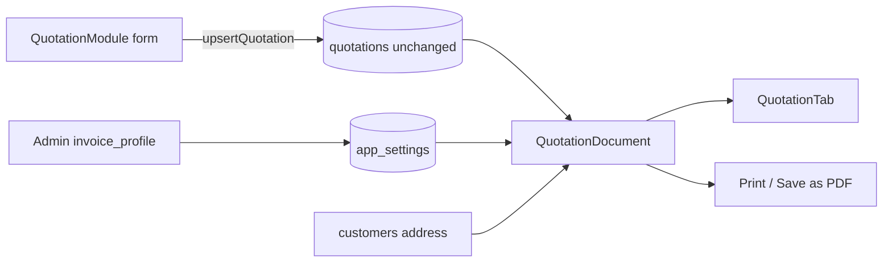

# Quotation document layout (portal + print)

## Decisions (locked)

- **Builder** stays a form for entering quote data (lines, GST %, terms, notes). It does not become the fancy document.
- **Customer portal** shows the Zoho-style quotation document (like your sample PDF).
- **Print/PDF**: shared document component + browser print (`window.print` + print CSS). Users can Save as PDF from the browser; no new PDF library in v1.
- **Quotation table / line math columns stay as they are** (`subtotal`, `tax`, `grand_total`, `signage_options` structure for qty/rate/gstRate, etc.).
- **No hardcoding** of The Board Company letterhead. Multi-tenant needs a company-scoped settings store.

## Why a small settings change is required

Without storing letterhead/bank/GSTIN per company, the only options are hardcoding or omitting those blocks. For multi-tenant you need per-company data.

**Approach:** add one JSONB column on existing company-scoped settings — `app_settings.invoice_profile` — edited in Admin Settings. This reuses the current `company_id` settings pattern in [`settingsActions.ts`](src/features/settings/actions/settingsActions.ts) / [`SettingsViewNew.tsx`](src/features/settings/components/SettingsViewNew.tsx). Quotation rows themselves are untouched.

```json
{
  "legalName": "Length X Breadth Marketing Solutions LLP",
  "brandName": "THE BOARD COMPANY",
  "address": "...",
  "gstin": "29AAKFL4647E1Z2",
  "email": "finance@theboardcompany.in",
  "website": "www.theboardcompany.in",
  "logoUrl": null,
  "placeOfSupplyDefault": "Karnataka (29)",
  "taxSplit": "cgst_sgst",
  "bank": {
    "accountName": "...",
    "accountType": "Current",
    "accountNumber": "...",
    "bankName": "AU Small Finance Bank",
    "branch": "Yelahanka, Bengaluru",
    "ifsc": "AUBL0002684"
  },
  "defaultTerms": "optional seed text for new quotes"
}
```

**HSN without new product/quotation columns:** optional `hsn` on each line inside existing `signage_options` JSONB (same pattern as `notes`). Builder gets an HSN field; portal/print render it. Empty HSN shows as blank, not a fake value.

## Document layout (portal + print)

New shared presentational component, e.g. [`src/features/quotations/components/QuotationDocument.tsx`](src/features/quotations/components/QuotationDocument.tsx), fed by:

| Sample field | Source |
|---|---|
| Letterhead / GSTIN / contact | `invoice_profile` |
| Quote No | `quotations.quotation_id` |
| Quote Date | `quotations.created_at` (or `updated_at` when Sent) |
| Bill To | order `business_name` / `client_name` + `customers.billing_address` |
| Place of Supply | `invoice_profile.placeOfSupplyDefault` (fallback: customer city) |
| Item & Description | `line.description` (+ measurement subtitle from section) |
| HSN | `line.hsn` (optional JSON field) |
| Qty / Rate | existing |
| Amount | **pre-tax** `qty × rate` via existing `calcLineAmount()` — matches sample |
| CGST / SGST | display-only: each `gstRate/2` and amount = pre-tax × that % when `taxSplit === "cgst_sgst"` |
| Sub Total / tax rows / Total | existing aggregates; tax summary split for display |
| Total in words | client helper on `grand_total` |
| Bank block | `invoice_profile.bank` |
| Terms | `quotations.terms` (render as numbered list when lines are numbered/newline-separated) |



## UI surfaces

1. **Portal** — replace the current table-in-cards UI in [`QuotationTab.tsx`](src/app/portal/components/QuotationTab.tsx) with `QuotationDocument` + Approve/Decline below it. Pass invoice profile + customer billing address from portal SSR ([`portal/page.tsx`](src/app/portal/page.tsx), [`portal/order/[orderId]/page.tsx`](src/app/portal/order/[orderId]/page.tsx)).

2. **Builder** — keep edit grid in [`QuotationModule.tsx`](src/features/orders/workspace/modules/quotation/QuotationModule.tsx); add:
   - optional **HSN** input per line
   - keep single **GST %** (underlying model unchanged); document view splits CGST/SGST for display
   - optional **Preview / Print** that opens `QuotationDocument` (same component as portal)

3. **Admin Settings** — new “Invoice / Quotation letterhead” section to edit `invoice_profile` (no hardcoding).

4. **Print** — Print button on portal (and builder preview) that applies `@media print` styles on `QuotationDocument` (hide nav/actions, letter-size layout).

## Tax display rules (UI-only)

- Line **Amount** column in the document = pre-tax (`calcLineAmount`), not GST-inclusive (builder can keep current inclusive amount for editing convenience, or show both — document follows the sample).
- CGST/SGST columns show amount + % under it (as in sample).
- Summary shows `CGST{n}` / `SGST{n}` rows grouped by rate when mixed rates exist (computed from lines, not new DB columns).
- If a future tenant needs IGST-only, `taxSplit: "igst"` shows one IGST column instead of CGST+SGST (same `gstRate`).

## Out of scope for this pass

- Changing `quotations` / `products` table columns
- True server-generated PDF binary (jsPDF/react-pdf) — print-to-PDF is enough for v1
- Per-line CGST/SGST stored separately (still one `gstRate`)

## Implementation order

1. Migration: `app_settings.invoice_profile jsonb default '{}'`
2. Settings actions + Admin UI for invoice profile
3. Shared `QuotationDocument` + number-to-words helper + tax-split helpers
4. Wire portal SSR + `QuotationTab`
5. Builder: HSN field + Preview/Print
6. Print CSS polish against the sample layout
