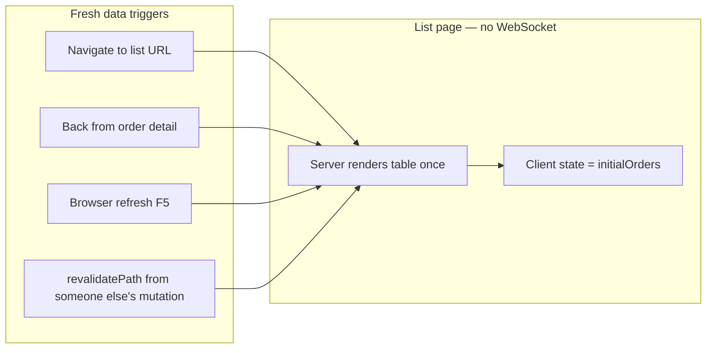

# Order Detail Realtime Sync Plan

## Decision (user-confirmed)

| Surface | Realtime? | How it stays fresh |
|---------|-----------|-------------------|
| **Order detail** — `OrderWorksheetModal`, portal order view | **Yes** — Supabase `postgres_changes` | Live push while tab is open |
| **List / queue** — `/admin/orders`, `/staff/site-visit`, etc. | **No** | `revalidatePath` (server) + navigation + `router.refresh()` |

This applies to **all stages** (site visit, quotation, design, production, installation) with one shared pattern.

---

## When exactly does realtime happen?

Realtime fires **only** when all of these are true:

1. **User is on a detail view** (not a list table).
2. **Component is mounted** — subscription starts in `useEffect`, tears down on unmount / navigate away.
3. **Another user (or tab) writes to Postgres** on a watched table for that order.
4. **Supabase Realtime** delivers the WAL event (~50–200ms).
5. **RLS allows the subscriber to see the row** (authenticated staff/admin via company scope; portal via scoped anon policies).

```mermaid
sequenceDiagram
  participant Actor as UserA_detail_or_action
  participant SA as ServerAction
  participant DB as Postgres
  participant RT as SupabaseRealtime
  participant Viewer as UserB_on_same_order_detail

  Note over Viewer: useOrderDetailSync mounted — WebSocket open

  Actor->>SA: save / approve / freeze
  SA->>DB: UPDATE orders / site_visits / etc.
  SA->>SA: revalidatePath (server cache — does NOT push to open browsers)
  DB->>RT: WAL change
  RT->>Viewer: postgres_changes payload
  Viewer->>Viewer: patch React state (no full page reload)

  Note over Actor: UserA also gets RT event if still on detail
  Note over Viewer: User on LIST page gets nothing until navigate/refresh
```

### Detail surfaces that subscribe

| Client | Route / component | Who |
|--------|-----------------|-----|
| [`OrderWorksheetModal.tsx`](src/features/order-detail/components/OrderWorksheetModal.tsx) | `/admin/orders/[id]`, `/staff/orders/[id]` | Admin, staff |
| [`OrderDetailClient.tsx`](src/app/portal/order/[orderId]/OrderDetailClient.tsx) | `/portal/order/[orderId]` | Customer (single order) |
| [`PortalClient.tsx`](src/app/portal/PortalClient.tsx) | `/portal` (active order tab) | Customer |
| [`OrderCommunicationCenter.tsx`](src/components/communication/OrderCommunicationCenter.tsx) | Chat drawer when open | All roles |

**Not subscribed:** [`OrdersManagementDashboard.tsx`](src/features/orders/components/OrdersManagementDashboard.tsx), [`AdminDashboardClient.tsx`](src/features/orders/components/AdminDashboardClient.tsx), any queue page under `/staff/site-visit`, `/staff/design`, etc.

---

## What is `revalidatePath` and where is it used?

`revalidatePath` is a **Next.js server-side** API. It marks cached Server Component data for a route as stale so the **next** server render fetches fresh data from the DB.

**Important:** it does **not** push updates to browsers that are already open. It is complementary to realtime:

| Mechanism | Runs where | Who benefits | When |
|-----------|------------|--------------|------|
| **Realtime** (`postgres_changes`) | Browser WebSocket | Users **on order detail** with tab open | Immediately on DB write |
| **`revalidatePath`** | Node server after mutation | Users who **navigate or refresh** list/detail | Next page load / `router.refresh()` |
| **`router.refresh()`** | Browser calls Next.js | Current tab re-fetches Server Components | After own action or explicit call |

### Central helper — staff/admin queue lists

[`revalidateStaffQueuePaths()`](src/features/orders/actions/orderActions.ts) invalidates all queue list routes in one call:

```ts
revalidatePath("/admin/orders");
revalidatePath("/staff/orders");
revalidatePath("/staff/site-visit");
revalidatePath("/staff/design");
revalidatePath("/staff/production");
revalidatePath("/staff/installation");
revalidatePath("/production/orders");
revalidatePath("/installation/orders");
revalidatePath("/installation/site-visit");
```

Called after most order mutations: site visit save/schedule/freeze, assignment changes, stage advances, etc.

### Per-order detail paths

After mutations, actions also revalidate the **specific order detail** routes (both friendly id and uuid):

```ts
revalidatePath(`/admin/orders/${orderId}`);
revalidatePath(`/staff/orders/${orderId}`);
revalidatePath("/portal");
revalidatePath(`/portal/order/${orderId}`);
```

### Other action files

| File | What triggers revalidation |
|------|---------------------------|
| [`orderActions.ts`](src/features/orders/actions/orderActions.ts) | Site visit, assignments, stage changes, production/install updates |
| [`quotationActions.ts`](src/features/quotations/actions/quotationActions.ts) | Quote create/update/send |
| [`designActions.ts`](src/features/designs/actions/designActions.ts) | Design uploads/approvals (also hits queue paths) |
| [`enquiryActions.ts`](src/features/enquiries/actions/enquiryActions.ts) | Enquiry → order conversion |

### `router.refresh()` in the UI

[`OrderWorksheetModal`](src/features/order-detail/components/OrderWorksheetModal.tsx) calls `router.refresh()` after many **local** actions (approve stage, freeze site visit, workflow change). That re-runs Server Components for the **current detail page** so `initialOrder` props stay aligned with DB — while realtime handles **other users** viewing the same order.

---

## How list pages get fresh data (no realtime)



**Typical flow:** Admin on `/admin/orders` → staff completes visit on detail → admin's table is **unchanged** until admin clicks into another order and back, or refreshes. That is **by design**.

### List refresh UX (in scope — no realtime)

Two explicit ways for users to refresh queue data without WebSockets:

1. **Manual "Refresh" button on queue header** — add to [`OrdersManagementDashboard.tsx`](src/features/orders/components/OrdersManagementDashboard.tsx) (shared by `/admin/orders`, `/staff/site-visit`, and other queue pages). On click: `router.refresh()`. Explicit, zero magic; user controls when the table re-fetches.
2. **`router.refresh()` on back from detail** — in [`OrderDetailPageClient`](src/app/admin/(dashboard)/orders/[id]/OrderDetailPageClient.tsx) `onClose`, call `router.refresh()` before `router.push(backHref)` so the queue re-fetches automatically when returning from an order.

**Not in scope:** focus refetch, polling, SSE, or queue-level Supabase channels.

---

## Target architecture — detail only, all stages

### One hook: `useOrderDetailSync`

Location: [`src/features/orders/realtime/useOrderDetailSync.ts`](src/features/orders/realtime/useOrderDetailSync.ts)

**One Supabase channel per mounted detail view**, multiple `.on()` handlers, **always server-side `filter:`**.

| Table | Filter | Stages | Events |
|-------|--------|--------|--------|
| `orders` | `id=eq.{orderUuid}` | All | `UPDATE` |
| `site_visits` | `order_id=eq.{orderUuid}` | Site visit | `*` |
| `site_visit_measurements` | `site_visit_id=eq.{siteVisitId}` | Site visit | `*` |
| `quotations` | `order_id=eq.{orderUuid}` | Quotation | `INSERT`, `UPDATE` |
| `designs` | `order_id=eq.{orderUuid}` | Design | `*` |
| `productions` | `order_id=eq.{orderUuid}` | Production | `*` |
| `installations` | `order_id=eq.{orderUuid}` | Installation | `*` |
| `order_activity` | `order_id=eq.{businessOrderId}` | Comms | `*` (or keep in `OrderCommunicationCenter` only) |

Hook API:

```ts
useOrderDetailSync({
  orderId: string,           // uuid
  businessOrderId: string,   // ORD-xxx for order_activity filter
  siteVisitId?: string,      // resolved once on mount
  onPatch: (patch: OrderDetailPatch) => void,
  enabled?: boolean,
})
```

Uses existing mappers: [`mapSiteVisitFromDb`](src/features/orders/actions/siteVisitMapper.ts), [`mapDesignFromDb`](src/features/designs/actions/designMapper.ts), etc.

### Refactor targets (remove duplication)

| File today | Action |
|------------|--------|
| [`OrderWorksheetModal.tsx`](src/features/order-detail/components/OrderWorksheetModal.tsx) | Replace inline `useEffect` subscriptions → `useOrderDetailSync` |
| [`PortalClient.tsx`](src/app/portal/PortalClient.tsx) | Same hook for active order |
| [`OrderDetailClient.tsx`](src/app/portal/order/[orderId]/OrderDetailClient.tsx) | Same hook |
| [`QuotationModule.tsx`](src/features/orders/workspace/modules/quotation/QuotationModule.tsx) | **Remove** its own `quotations` subscription — parent hook feeds quote state |

Child stage modules (`SiteVisitModule`, `DesignModule`, etc.) **never** open their own channels — they receive props / context from parent order state.

### Performance guardrails

- **1 WebSocket per detail tab** — not per stage tab, not per table row.
- **Filtered subscriptions only** — never subscribe to full `orders` table.
- **`removeChannel` on unmount** — unique channel name per mount (Strict Mode safe).
- **Measurements only on detail** — `site_visit_measurements` subscription stays in detail hook (fixes cross-user measurement sync gap).
- **Keep `revalidatePath`** in server actions — do not remove; lists depend on it.

Expected load: ~1 connection per user per open order detail. Trivial for team size.

---

## Database prerequisites

Migration (e.g. `supabase/migrations/YYYYMMDD_order_detail_realtime.sql`):

1. Ensure tables are in `supabase_realtime` publication: `orders`, `site_visits`, `site_visit_measurements`, `quotations`, `designs`, `productions`, `installations`, `order_activity`.
2. **Portal RLS** — customer browser uses anon Supabase client. Add scoped `anon` SELECT policies (via `SECURITY DEFINER` helper checking `portal_access_tokens` + customer ownership) so portal detail realtime is not silently empty after tenant RLS migration.

---

## Implementation steps

### Step 1 — `useOrderDetailSync` hook

- Resolve `siteVisitId` once (from initial order props or lightweight query).
- Subscribe all stage tables on one channel.
- Map payloads → `onPatch` partial order updates.
- Toast when `stage` or `stage_status` changes from external actor (spec: [`admin-dashboard.md`](specs/admin-dashboard.md)).

### Step 2 — Wire admin/staff detail

- [`OrderWorksheetModal.tsx`](src/features/order-detail/components/OrderWorksheetModal.tsx): replace existing subscriptions.
- Keep `router.refresh()` after **own** mutations for SSR prop alignment.

### Step 3 — Wire customer portal detail

- [`PortalClient.tsx`](src/app/portal/PortalClient.tsx) + [`OrderDetailClient.tsx`](src/app/portal/order/[orderId]/OrderDetailClient.tsx).
- Verify portal RLS (Step 4 migration).

### Step 4 — Deduplicate child modules

- Remove quotation channel from [`QuotationModule.tsx`](src/features/orders/workspace/modules/quotation/QuotationModule.tsx).
- Audit other modules for stray `createClient` + `.channel()` calls.

### Step 5 — List refresh hygiene (no realtime)

- Confirm all stage mutations call `revalidateStaffQueuePaths()` + detail paths (audit below).
- **Refresh button on queue header** — in [`OrdersManagementDashboard.tsx`](src/features/orders/components/OrdersManagementDashboard.tsx), add a header "Refresh" control that calls `router.refresh()` (applies to all queue pages using this component).
- **Refresh on back from detail** — in [`OrderDetailPageClient`](src/app/admin/(dashboard)/orders/[id]/OrderDetailPageClient.tsx) `onClose`, call `router.refresh()` before `router.push(backHref)`.

#### `revalidatePath` audit — list pages (verified)

**Yes, list-page `revalidatePath` is necessary.** Without it, Next.js may serve **cached** queue HTML/data after a mutation until the user navigates/refreshes — even if the DB is already updated. It pairs with the planned Refresh button and back-navigation `router.refresh()`.

**Central helper** — [`revalidateStaffQueuePaths()`](src/features/orders/actions/orderActions.ts) invalidates all queue list routes:

`/admin/orders`, `/staff/orders`, `/staff/site-visit`, `/staff/design`, `/staff/production`, `/staff/installation`, `/production/orders`, `/installation/orders`, `/installation/site-visit`

| Action file | List revalidation | Status |
|-------------|-------------------|--------|
| [`orderActions.ts`](src/features/orders/actions/orderActions.ts) | `await revalidateStaffQueuePaths()` on site visit, assignments, stage changes, prod/install | **Complete** |
| [`enquiryActions.ts`](src/features/enquiries/actions/enquiryActions.ts) | `await revalidateStaffQueuePaths()` on enquiry → order | **Complete** |
| [`paymentActions.ts`](src/features/payments/actions/paymentActions.ts) | `await revalidateStaffQueuePaths()` | **Complete** |
| [`designActions.ts`](src/features/designs/actions/designActions.ts) | Local `revalidateDesignPaths()` — duplicates helper, missing `/installation/site-visit` | **Fix:** switch to `revalidateStaffQueuePaths()` |
| [`quotationActions.ts`](src/features/quotations/actions/quotationActions.ts) | Only `revalidatePath("/admin/orders")` + some detail paths | **Gap:** add `await revalidateStaffQueuePaths()` + staff/portal detail paths to all write actions |

**`quotationActions.ts` functions to fix:** `upsertQuotation`, `sendQuotationToCustomer`, `adminMarkQuotationApprovedAction`, `customerApproveQuotation`, `customerRequestRevision` — each should call `revalidateStaffQueuePaths()` and revalidate `/staff/orders/{id}`, `/portal`, `/portal/order/{id}` alongside existing admin paths.

### Step 6 — Verification

| Scenario | List page | Detail page (other user) |
|----------|-----------|--------------------------|
| Staff saves site visit measurements | Stale until navigate | Updates live |
| Staff freezes visit | Stale until navigate | `stage_status` + `completed` live |
| Admin approves stage | Stale until navigate | Stage advances live |
| Customer schedules visit | Stale until navigate | Audit date/time live |
| Quotation sent | Stale until navigate | Quote status live |
| Design approved | Stale until navigate | Design state live |
| User closes detail → back to queue | **Fresh** (auto `router.refresh` on back) | N/A |
| User clicks Refresh on queue header | **Fresh** (`router.refresh`) | N/A |

---

## Explicitly out of scope

- Realtime on list/queue dashboards.
- Broadcast / presence.
- Polling or SSE for lists.
- Replacing `revalidatePath` — it remains the list refresh mechanism.

---

## Risk notes

- **Portal anon RLS** — highest risk; detail realtime useless for customers until fixed.
- **Realtime publication** — tables must be enabled in Supabase Dashboard if not in migrations.
- **QuotationModule dedup** — ensure quote UI still updates when parent patches `quoteDetails` / passes revised props.
