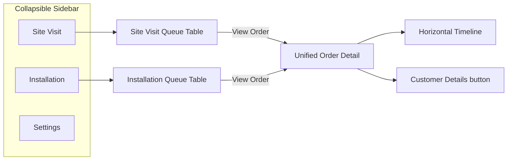
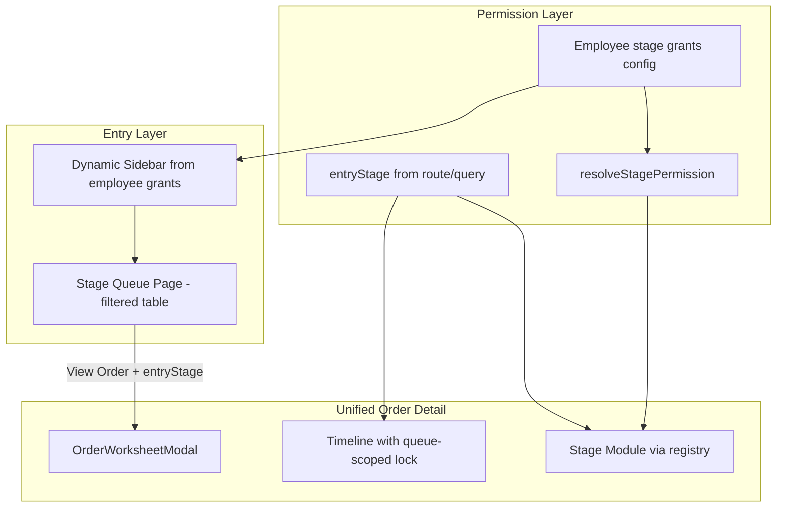

# Unified Staff Workflow Plan

## What I Understood (Confirmed)

You are describing a **role-configurable staff dashboard** where each employee sees only the **stage queues they handle**, but every queue opens the **same unified order detail page** (`OrderWorksheetModal` via [`OrderDetailPageClient.tsx`](src/app/admin/(dashboard)/orders/[id]/OrderDetailPageClient.tsx)).

### Example: Installation Manager (Client X)



**Sidebar (left, collapsible):**
- Site Visit
- Installation
- Settings

**Site Visit tab:**
- Shows a **stage-filtered order table** (same pattern as [`/staff/site-visit`](src/app/staff/(dashboard)/site-visit/page.tsx) today)
- Only orders in site-visit stages
- "View Order" → unified order detail

**Installation tab:**
- Shows the **Installation queue table** (same UI as [`/installation/orders`](src/app/installation/(dashboard)/orders/page.tsx) today)
- Only orders in installation-related stages
- "View Order" → same unified order detail

**Order detail behavior (queue-scoped):**
- Same page shell for everyone: project header, **Customer Details** button, horizontal timeline, stage module area
- **Only the stage matching the queue they entered from is accessible** (you confirmed queue-scoped, not all-permitted)
- All other timeline nodes remain **visible but dulled** — not clickable, **no module content shown**
- Admin continues to see and edit all stages

This replaces the current model where Production and Installation are separate portals with their own detail pages ([`ProductionOrderDetailClient`](src/app/production/(dashboard)/orders/[id]/ProductionOrderDetailClient.tsx), [`InstallationOrderDetailClient`](src/app/installation/(dashboard)/orders/[id]/InstallationOrderDetailClient.tsx)).

---

## Current State vs Target

| Area | Today | Target |
|------|-------|--------|
| Sidebar nav | Hardcoded per portal layout ([`ProductionLayoutClient`](src/app/production/(dashboard)/ProductionLayoutClient.tsx), [`InstallationLayoutClient`](src/app/installation/(dashboard)/InstallationLayoutClient.tsx), [`StaffLayoutClient`](src/app/staff/(dashboard)/StaffLayoutClient.tsx)) | **Configurable per employee/tenant** — only assigned stage queues appear |
| Order lists | Separate routes, separate filters | **Reuse existing queue table components**, filtered by stage |
| Order detail | Admin/Staff use worksheet; Production/Install use portal detail wrappers | **One `OrderWorksheetModal` for all** |
| Timeline RBAC | All nodes clickable; `resolveStagePermission` only disables controls inside Prod/Install modules | **Queue-scoped stage lock** on timeline + hide locked module content |
| Permission source | Hardcoded matrix in [`permissions.ts`](src/features/orders/workspace/shared/permissions.ts) | **Configurable grants file** (Phase 1), DB-backed later |

---

## Architecture



**Key rule:** `canAccessStage = resolveStagePermission(stage, actor).canEdit AND stage === entryStage`

- `entryStage` is passed when navigating from a queue (e.g. `/staff/orders/[id]?from=installation` or route segment `/installation/orders/[id]`)
- Locked stages: greyed timeline node, `pointer-events: none`, module not rendered
- Customer Details button: always available (read-only customer info)

---

## Phase 0 — Stabilize (already in progress)

**Goal:** Admin/staff demo path works before broader rollout.

- Verify Production + Installation tabs in [`OrderWorksheetModal.tsx`](src/features/order-detail/components/OrderWorksheetModal.tsx) with embedded modules
- Confirm RLS on `productions` / `installations` (migration applied)
- Smoke-test Marketer/Designer see disabled controls on Prod/Install modules

---

## Phase 1 — Configurable grants + timeline queue lock

### 1a. Employee stage grants config

Create a tenant-scoped config (start as a file, e.g. `src/features/orders/workspace/shared/stageGrants.ts`):

```ts
// Example shape — editable per client without code changes later
export const STAGE_GRANTS_BY_STAFF_ROLE: Record<string, OrderStage[]> = {
  Production: ["production"],
  Installation: ["site_visit", "installation"], // Client X: handles both
  Designer: ["site_visit", "design"],
  Marketer: ["site_visit", "quotation"],
};
```

Also export helpers:
- `getNavItemsForActor(actor)` → sidebar tabs (Site Visit, Installation, Production, etc.)
- `getEditableStages(actor)` → used by `resolveStagePermission`

Update [`permissions.ts`](src/features/orders/workspace/shared/permissions.ts) to read from this config instead of inline `EDITABLE_STAGES_BY_STAFF_ROLE`.

### 1b. Queue-scoped timeline lock in OrderWorksheetModal

Add prop: `entryStage?: OrderStage` (from route wrapper).

In timeline render (~line 1178 in `OrderWorksheetModal`):
- Compute `isAccessible = stage === entryStage && resolveStagePermission(stage, actor).canEdit` (admin bypasses — all stages accessible)
- Locked node: muted colors, `disabled`, no `setActiveStepTab` on click
- On mount: `setActiveStepTab` to `entryStage` (not order's current stage)
- `renderModule()`: return null / locked placeholder if active tab is not accessible

Admin: no `entryStage` lock — all stages remain clickable.

### 1c. Dynamic sidebar (first tenant: Installation Manager pattern)

Refactor portal layouts into a shared **StaffWorkspaceLayout** that:
- Reads `getNavItemsForActor(profile)` for sidebar items
- Each item links to its queue route
- Keeps existing collapse/expand behavior from Production/Installation layouts
- Settings tab preserved

For Client X Installation Manager, sidebar shows: **Site Visit | Installation | Settings**.

### 1d. Optional floor portals (tenant flag)

`/production/*` and `/installation/*` are **Printoms floor/kiosk overlays**, not the default staff model.

- `TENANT_USES_FLOOR_PORTALS[company_id]` gates portal access (plus stage grants).
- All staff (including production/installation grant holders) use `/staff/login` by default.
- Floor login uses `productionFloorSignIn` / `installationFloorSignIn` — rejects accounts whose tenant is not opted in.
- Home gateway cards: **Production Floor** / **Installation Floor**.
- Primary staff paths: `/staff/production`, `/staff/installation`, `/staff/site-visit`, `/staff/design`, `/staff/orders/[id]?entryStage=…`.

---

## Phase 2 — Route consolidation + queue pages

### 2a. Unified order detail routes

All "View Order" links from any queue route to the same detail component with `entryStage`:

| Queue | Route (keep URL for layout guard) | Detail renders |
|-------|-----------------------------------|----------------|
| Production | `/production/orders/[id]` | `OrderDetailPageClient` + `entryStage="production"` |
| Installation | `/installation/orders/[id]` | `OrderDetailPageClient` + `entryStage="installation"` |
| Site Visit | `/staff/site-visit/orders/[id]` or `/staff/orders/[id]?from=site_visit` | same + `entryStage="site_visit"` |

Thin wrappers only — delete duplicate portal detail UI in [`ProductionOrderDetailClient`](src/app/production/(dashboard)/orders/[id]/ProductionOrderDetailClient.tsx) and [`InstallationOrderDetailClient`](src/app/installation/(dashboard)/orders/[id]/InstallationOrderDetailClient.tsx).

### 2b. Reuse existing queue tables

| Stage | Reuse component | Stage filter (existing) |
|-------|-----------------|-------------------------|
| Production | [`ProductionDashboardClient`](src/app/production/(dashboard)/orders/ProductionDashboardClient.tsx) | `Design Approved` → `Closed` |
| Installation | [`InstallationDashboardClient`](src/app/installation/(dashboard)/orders/InstallationDashboardClient.tsx) | `Ready For Installation` → `Closed` |
| Site Visit | [`OrdersManagementDashboard`](src/features/orders/components/OrdersManagementDashboard.tsx) on staff site-visit page | Site visit stages + assigned filter |

No UI redesign — same tables as your Production screenshot.

### 2c. Layout guards

Keep route-prefix guards (e.g. `/production/*` requires Production staff or admin) but allow multi-grant employees to access multiple prefixes based on `STAGE_GRANTS_BY_STAFF_ROLE`.

---

## Phase 3 — Extract remaining stage modules

Follow Production/Installation extraction pattern for:
- Site Visit → [`SiteVisitModule`](src/features/order-detail/components/site-visit/) (already exists, wire to workspace registry)
- Quotation → workspace module
- Design → workspace module

Goal: `OrderWorksheetModal` tab content comes entirely from [`src/features/orders/workspace/modules/`](src/features/orders/workspace/modules/).

---

## Phase 4 — Server-side permission enforcement

UI lock is UX only. Add `resolveStagePermission` checks inside mutation server actions:
- [`orderActions.ts`](src/features/orders/actions/orderActions.ts) (production)
- [`installationActions.ts`](src/features/installations/actions/installationActions.ts)
- Quotation, site visit, design actions

Reject unauthorized mutations with 403 regardless of UI state.

---

## Phase 5 — Tenant isolation

- Add `company_id` to queries and RLS policies
- Grants config becomes per-tenant (DB table `employee_stage_grants` replacing static file)

---

## Phase 6 — Workflow flags + Admin Review

- Admin Control / Payments tabs remain admin-only
- Workflow progression gates (stage must be reached before edit) layered on top of RBAC, separate from `resolveStagePermission`

---

## What We Are NOT Doing Yet

- Redesigning queue table UI
- Changing business logic inside stage modules
- Hiding timeline nodes entirely (they stay visible, dulled)
- Allowing cross-stage navigation for multi-grant employees (queue-scoped only, per your choice)

---

## Success Criteria

1. Installation Manager at Client X sees **Site Visit + Installation + Settings** in sidebar
2. Installation queue shows same table as current installation portal
3. Clicking an order opens unified detail with **Customer Details** button
4. From Installation queue: **only Installation timeline node is active**; others dulled, no content
5. From Site Visit queue: **only Site Visit node is active**
6. Admin: all stages accessible, unchanged omnipotent behavior
7. Production Manager pattern works identically with Production-only nav
