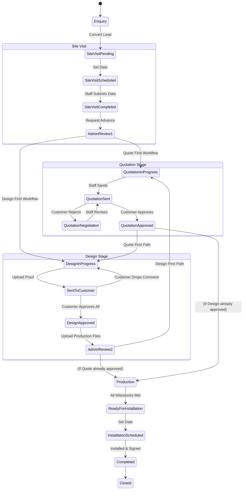

# OMS Current Implementation Specification
*This document serves as the definitive source of truth for the current functional and technical implementation of the Order Management System (OMS).*

---

## 1. The Complete Story

The lifecycle of a project in the OMS moves through various distinct phases, acting as a state machine. 

### 1.1 Customer Enquiry
A potential customer drops an enquiry via a web form, WhatsApp, or a phone call. An entry is created in the `enquiries` table with `status="Pending"`. Sales staff reviews the enquiry, contacts the customer, and if the lead is valid, they click "Convert to Order". This automatically migrates the lead into the `orders` table, creating a new project. 

### 1.2 Site Visit
Every order begins with a mandatory Site Visit check.
* **Pending:** The order is at `Site Visit Pending`. Staff accesses the order, communicates with the client to determine the installation location, and inputs the audit date/time. A Google Maps link can be automatically requested.
* **Scheduled:** Once date/time and locations are saved, the order moves to `Site Visit Scheduled`.
* **Completed:** Field staff physically visit the site, fill out a form with GPS coordinates, dimensions, photos, and structural/electrical notes, then mark the visit as completed. 
* **Admin Review:** The Site Visit data requires an Admin's approval (`Pending Admin Approval: Site Visit Completed`). The admin reviews the measurements and chooses the **Workflow Routing** for the rest of the project.

### 1.3 Workflow Routing (The Fork in the Road)
Upon approving the Site Visit, the Admin must select the workflow type:
1. **Quote First (Standard):** `Site Visit` ➔ `Quotation` ➔ `Design` ➔ `Production`
2. **Design First (Custom):** `Site Visit` ➔ `Design` ➔ `Quotation` ➔ `Production`

### 1.4 Quotation Stage
* **In Progress:** Staff/Admin prepares a quote based on measurements using catalogue prices and custom discounts.
* **Sent:** The quote is sent to the customer portal. The customer gets a magic link to review it.
* **Customer Review:** 
  * If the customer clicks "Approve", the quote is `Quotation Approved` and the system auto-advances the order.
  * If the customer clicks "Request Changes", the order enters `Quotation Negotiation`. Staff negotiates and sends a revised quote.

### 1.5 Design Stage
* **In Progress:** Designers upload visual proofs (versions) of the signage to the order.
* **Sent to Customer:** Customer accesses the portal and reviews the design versions.
  * **Changes Requested:** Customer can click directly on the image to drop pinpoint comments. This rejects the version, sending it back to `Design In Progress`.
  * **Approved:** Customer approves individual items. The order only advances to `Design Approved` when *every single active design item* has its latest version approved by the customer.
* **Production Prep:** Staff must upload the final vector cut-files (PDF/AI) for each design before the stage can truly be completed. 

### 1.6 Production Stage
Once designs are approved (and the quote is approved), the Admin clicks "Approve & Advance" to push the order to `Production`. 
* **Tracking:** The factory floor checks off four boolean milestones: Procurement of Materials, ACP & Acrylic Cutting, Lighting & Wiring, and Quality Check. 
* **Completion:** Once all four checkboxes are ticked, the order is advanced to `Ready For Installation`.

### 1.7 Installation & Completion
* **Scheduled:** Staff schedules the installation date and time.
* **Customer Location:** Customer may provide an exact Google Maps drop-pin via the portal.
* **Completed:** Field workers upload photos of the installed sign and collect a customer signature or payment code. The order moves to `Completed` and eventually `Closed`.

---

## 2. Stage Breakdown

### 2.1 Site Visit
* **Purpose:** Gather physical measurements, photos, and structural requirements.
* **Who is responsible:** Site Visit Field Staff.
* **What data is collected:** `customerAddress`, `gpsLocation`, `auditDate`, `auditTime`, Array of `locations` (Width, Height, Depth, Photos, Wall Type, Mounting Method, Power availability).
* **Who approves:** Admin (Admin Control Panel).
* **Validations:** Cannot advance unless an audit date is set and at least one sign location is created.
* **Edge Cases:** Staff can "Skip Site Visit" if manual entry from the customer is sufficient.

### 2.2 Quotation
* **Purpose:** Finalize pricing and terms with the customer.
* **Who is responsible:** Marketer / Sales Staff / Admin.
* **What data is collected:** Array of `QuoteItems` (description, qty, unit, unitPrice, totalSqFt, gstRate), `discount`, `terms`.
* **Who approves:** Customer (via Portal).
* **Validations:** Subtotal and taxes must compute correctly before sending.

### 2.3 Design
* **Purpose:** Create, review, and finalize visual proofs and production files.
* **Who is responsible:** Designer.
* **What data is collected:** Array of `items`, each containing `versions` (proof URLs, AI file URLs) and `comments` (x/y coordinates on image). Array of `productionFiles`.
* **Who approves:** Customer (Proof), Admin (Final Stage Advance).
* **Validations:** Cannot advance the stage unless all design items are "Approved" by the customer AND all items have `productionFiles` uploaded.

### 2.4 Production
* **Purpose:** Track physical manufacturing progress.
* **Who is responsible:** Production Manager.
* **What data is collected:** Booleans for `procurementOfMaterials`, `acpAndAcrylicCutting`, `lightingAndWiring`, `qualityCheck`.
* **Who approves:** Admin or Production Manager (implicitly by checking all boxes).

### 2.5 Installation
* **Purpose:** Deploy the product and get final sign-off.
* **Who is responsible:** Installation Team.
* **What data is collected:** `scheduledDate`, `scheduledTime`, `gmapLink`, `photoUrl`, `customerSignature`.
* **Who approves:** Admin marks as Completed.

---

## 3. Role-Based Story

### 3.1 Admin
* **Views:** Has God-mode access. Sees all panels, settings, financials, and internal timelines.
* **Actions:** The only role capable of approving stage advancements when an order hits a "Pending Admin Approval" block.
* **Overrides:** Can unlock frozen modules to edit details of past stages without rolling back the entire order status.
* **Assignments:** Assigns Employees to Orders based on workload statistics.

### 3.2 Staff (Employees)
* **General:** See orders they are assigned to. Cannot advance major stages.
* **Designers/Marketers:** Restricted via `isReadOnly` flags from modifying Installation or Production checkboxes. Can only upload designs/quotes.
* **Production/Installation:** Restricted from quoting or design overrides. See their specific checklists and upload completed photos.

### 3.3 Customer
* **Access:** Uses a passwordless Magic Link (Token-based) to access the Portal.
* **Views:** Sees Enquiries, Site Visit schedule, Quotations, Designs, Production status, and Installation details.
* **Actions:** Can approve/reject quotes, drop visual pin comments on designs, upload resources for designers, and submit GMap links for installers. 
* **Limitations:** Cannot see internal chat, internal notes, or production files (cut files).

---

## 4. Permissions Matrix

| Feature / Stage       | Admin                 | Staff (Assigned)      | Customer              |
|-----------------------|-----------------------|-----------------------|-----------------------|
| **Enquiries**         | Read, Write, Convert  | Read, Write, Convert  | None                  |
| **Site Visit Data**   | Read, Write, Override | Read, Write (if active)| Read (Schedule only)  |
| **Stage Advancing**   | Approve               | Request Advance       | None                  |
| **Quotation**         | Read, Write           | Read, Write (Sales)   | Read, Approve, Reject |
| **Design Proofs**     | Read, Upload          | Read, Upload          | Read, Comment, Approve|
| **Production Files**  | Read, Upload          | Read, Upload          | Hidden                |
| **Production Status** | Read, Write           | Read, Write (Prod)    | Read (Status text)    |
| **Installation**      | Read, Write           | Read, Write (Inst)    | Read, Provide Maps    |
| **Internal Chat**     | Read, Write           | Read, Write           | Hidden                |

---

## 5. Order State Machine



---

## 6. Database Flow

### 6.1 Tables Touched
* `users` - Stores Admin and Staff profiles.
* `customers` - Stores client contact and address details.
* `enquiries` - Pre-order lead tracking.
* `orders` - The central spine. Holds `stage`, `workflow_type`, `design_details` (JSONB), `production_details` (JSONB), `installation_details` (JSONB).
* `site_visits` / `site_visit_measurements` - Relational tables tracking audit metrics and locations.
* `quotations` / `quote_items` - Relational tables for financial pricing.
* `order_assignments` - Join table mapping `orders` to `users` (Staff).
* `order_activity` - Immutable append-only log capturing all stage changes, approvals, and internal chats.

### 6.2 Storage Uploads
* Files (Proofs, AI files, Installation Photos, Site Visit Photos) are uploaded to Supabase Storage Buckets.
* URLs are generated and written into the respective JSONB columns (`design_details`) or relational tables.

---

## 7. Component Map

```text
Order Detail Page
├── OrderDetailClient (Orchestrator, Supabase Realtime Listener)
│   ├── Workflow Status Bar
│   ├── OrderWorksheetModal (The main workspace)
│   │   ├── SiteVisitModule (Form inputs, location mapping)
│   │   │   └── SiteVisitReviewModal (Staff submits for review)
│   │   ├── QuotationModule (Dynamic pricing table, GST calcs)
│   │   ├── DesignModule (Proof uploads, versions, Prod file uploads)
│   │   ├── ProductionModule (4-step checkbox UI)
│   │   ├── InstallationModule (Scheduling, GPS links, completion photos)
│   │   ├── AdminControlModule (Approval buttons, assignment UI, unlocked module access)
│   │   └── WorkflowChoiceModal (Admin selects Quote-First vs Design-First)
│   └── Activity Sidebar (Timeline, internal chat)
│
Customer Portal
├── PortalClient (Token-validated session)
│   ├── Site Visit View (Schedule read-only, Skip notification)
│   ├── Quotation View (Approve/Reject buttons)
│   ├── DesignTab (Interactive Image Pinning, Approval logic)
│   ├── Production View (Read-only status ticks)
│   └── Installation View (Google Maps URL input, Photo gallery)
```

---

## 8. Server Action Map

| Action | Purpose | Called From | Updates | Permissions |
|--------|---------|-------------|---------|-------------|
| `createOrder` | Converts Enquiry to Order | Enquiry Board | `orders`, `designs`, `order_activity` | Admin, Staff |
| `updateOrderStageAction` | Manual manual stage jump | Admin Override | `orders.stage`, `order_activity` | Admin |
| `adminApproveStageAction` | Validates and pushes stage fwd | `AdminControlModule` | `orders.stage`, `order_activity` | Admin |
| `setWorkflowTypeAction` | Sets design-first vs quote-first | `WorkflowChoiceModal` | `orders.workflow_type` | Admin |
| `updateDesignDetailsAction` | Mutates the JSONB design payload | `DesignModule`, `DesignTab` | `orders.design_details` | Admin, Designer |
| `assignTeamToOrder` | Links staff to an order | `AdminControlModule` | `order_assignments` | Admin |
| `updateQuotationAction` | Saves relational quote data | `QuotationModule` | `quotations`, `quote_items` | Admin, Marketer |
| `provideInstallationLocationAction` | Customer submits maps link | `PortalClient` | `orders.installation_details` | Customer |

---

## 9. Business Rules

1. **Design Approval Gate:** An order's design stage cannot be marked "Approved" by the customer until *every single item* has its most recent version marked as "Approved". 
2. **Production File Gate:** An Admin cannot advance an order from Design to Production until `productionFiles` have been uploaded for all design items.
3. **Implicit Overrides:** Admins have an "Unlock" toggle in the UI allowing them to edit Site Visit or Design details even after the stage is completed, bypassing strict sequential locks.
4. **Customer Auth:** Customers do not have passwords. They access the portal via a secure hashed UUID token URL.
5. **Real-time Syncing:** `OrderDetailClient` binds to Supabase Realtime Channels. When the customer approves a quote or drops a pin, the Staff screen updates instantly without refreshing.

---

## 10. Technical Debt & Future Improvements

### 10.1 Known Technical Debt
* **JSONB vs Relational Split:** `site_visits` and `quotations` were recently migrated to strict relational SQL tables, but `design_details`, `production_details`, and `installation_details` are still stored as massive JSONB blobs on the `orders` table. This makes querying "All active designs" at a database level extremely difficult.
* **Duplicated Stage Logic:** The `stageToTabIndex` calculation logic is duplicated across `OrderWorksheetModal.tsx` and `PortalClient.tsx`, which can cause desyncs if the workflow is altered.
* **Prop Drilling:** `OrderWorksheetModal.tsx` is exceedingly large (>1200 lines) and passes dozens of props down into `SiteVisitModule`, `DesignModule`, etc.

### 10.2 Recommended Future Improvements
1. **Migrate Designs to SQL:** Break `design_details` out of the JSONB column into `designs`, `design_items`, `design_versions`, and `design_comments` tables to match Quotations.
2. **Context API / Zustand:** Implement a global state manager for the active Order to eliminate the massive prop-drilling inside `OrderWorksheetModal`.
3. **Automated Notifications:** Connect Supabase Edge Functions or Postgres Triggers to automatically send Emails/WhatsApp messages when `order_activity` registers a "Quotation Sent" or "Design Sent" event.

---

## 11. Final Summary

**Overall Architecture:** A monolithic Next.js (App Router) application backed by Supabase (PostgreSQL). State is primarily tracked via an `orders` table, surrounded by related entity tables, communicating via Server Actions.
**Current Strengths:** Robust file handling, real-time customer feedback loops via the portal, strict permission checks, and flexible branch routing (`workflow_type`).
**Known Limitations:** Over-reliance on JSONB for core order sub-data, which will inhibit future analytical querying capabilities.
